# fp-inntektsmelding

***

Backend for inntektsmelding for Team Foreldrepenger

## Oppdatere graphql skjema til Arbeidsgiver Notifikasjon API

Bytt ut [produsent.graphql](./src/main/resources/graphql/produsent.graphql) med SDL skjemaet som man kan lastes ned fra playground i
arbeidsgiver-notifikasjon sitt [notifikasjon-fake-produsent-api](https://notifikasjon-fake-produsent-api.ekstern.dev.nav.no/)

Oppdatert `schema.graphql` kan hentes [herfra](https://github.com/navikt/arbeidsgiver-notifikasjon-produsent-api/blob/main/app/src/main/resources/produsent.graphql).

## Diagrammer

```mermaid
graph TB
    subgraph REST["🌐 REST Layer (Endpoints)"]
        direction TB
        IMDialogRest["<b>InntektsmeldingDialogRest</b><br/>/imdialog<br/><i>GET /opplysninger</i><br/><i>GET /inntektsmeldinger</i><br/><i>POST /send-inntektsmelding</i><br/><i>GET /last-ned-pdf</i>"]
        AGInitRest["<b>ArbeidsgiverinitiertDialogRest</b><br/>/arbeidsgiverinitiert<br/><i>POST /arbeidsforhold</i><br/><i>POST /arbeidsgivereForUregistrert</i><br/><i>POST /opplysninger</i><br/><i>POST /opplysningerUregistrert</i>"]
        KvittRest["<b>KvitteringRest</b><br/>/ekstern<br/><i>GET /kvittering/{uuid}</i><br/><i>GET /innsendt/{uuid}</i><br/><i>GET /innsendt/inntektsmelding/{uuid}</i>"]
        ForespRest["<b>ForespørselRest</b><br/>/foresporsel<br/><i>POST /opprett</i><br/><i>POST /lukk</i><br/><i>POST /ny-beskjed</i><br/><i>POST /sett-til-utgatt</i>"]
        ForespEkstRest["<b>ForespørselEksternRest</b><br/>/foresporsel-ekstern<br/><i>GET /hent/{uuid}</i><br/><i>POST /hent/foresporsler</i>"]
        OverstyringRest["<b>InntektsmeldingFpsakRest</b><br/>/overstyring<br/><i>POST /inntektsmelding</i>"]
        IMApiRest["<b>InntektsmeldingApiRest</b><br/>/inntektsmelding<br/><i>GET /hent</i>"]
        ForvOppgRest["<b>OppgaverForvaltningRestTjeneste</b><br/>/forvaltningOppgaver<br/><i>POST /slettOppgave</i><br/><i>POST /settTilUtgatt/{uuid}</i><br/><i>POST /nyBeskjed</i>"]
        ForvDialogRest["<b>DialogportenForvaltningRestTjeneste</b><br/>/dialogporten<br/><i>POST /opprettDialog</i><br/><i>POST /ferdigstillerDialog</i>"]
    end

    subgraph TJENESTER["⚙️ Service Layer (Tjenester)"]
        direction TB
        GrunnlagDtoTj["<b>GrunnlagDtoTjeneste</b><br/><i>Builds dialog DTOs,<br/>fetches person/org/inntekt data</i>"]
        IMMottakTj["<b>InntektsmeldingMottakTjeneste</b><br/><i>Receives & processes<br/>inntektsmeldinger</i>"]
        KvitteringTj["<b>KvitteringTjeneste</b><br/><i>Generates PDF receipts</i>"]
        ForespBehandlingTj["<b>ForespørselBehandlingTjeneste</b><br/><i>Orchestrates forespørsel<br/>lifecycle & notifications</i>"]
        ForespTj["<b>ForespørselTjeneste</b><br/><i>CRUD operations<br/>for forespørsler</i>"]
        IMTjeneste["<b>InntektsmeldingTjeneste</b><br/><i>CRUD operations<br/>for inntektsmeldinger</i>"]
        IMOverstyringTj["<b>InntektsmeldingOverstyringTjeneste</b><br/><i>Handles overridden<br/>inntektsmeldinger</i>"]
        ForespEkstTj["<b>ForespørselEksternTjeneste</b><br/><i>External forespørsel<br/>queries</i>"]
        PipTj["<b>PipTjeneste</b><br/><i>Policy Information Point<br/>(access control lookups)</i>"]
        AltinnTilgangTj["<b>AltinnTilgangTjeneste</b><br/><i>Altinn permission checks</i>"]
    end

    subgraph REPO["🗄️ Repository / Database Layer"]
        direction TB
        ForespRepo["<b>ForespørselRepository</b><br/><i>EntityManager → FORESPØRSEL table</i>"]
        IMRepo["<b>InntektsmeldingRepository</b><br/><i>EntityManager → INNTEKTSMELDING table</i>"]
        DB[("PostgreSQL<br/>Database")]
    end

    %% REST → Service connections
    IMDialogRest -->|grunnlagDtoTjeneste| GrunnlagDtoTj
    IMDialogRest -->|inntektsmeldingMottakTjeneste| IMMottakTj
    IMDialogRest -->|kvitteringTjeneste| KvitteringTj
    IMDialogRest -->|forespørselBehandlingTjeneste| ForespBehandlingTj
    IMDialogRest -->|inntektsmeldingTjeneste| IMTjeneste

    AGInitRest -->|grunnlagDtoTjeneste| GrunnlagDtoTj

    KvittRest -->|inntektsmeldingTjeneste| IMTjeneste
    KvittRest -->|kvitteringTjeneste| KvitteringTj

    ForespRest -->|forespørselBehandlingTjeneste| ForespBehandlingTj

    ForespEkstRest -->|forespørselApiTjeneste| ForespEkstTj

    OverstyringRest -->|overstyringTjeneste| IMOverstyringTj

    IMApiRest -->|inntektsmeldingTjeneste| IMTjeneste

    ForvOppgRest -->|forespørselBehandlingTjeneste| ForespBehandlingTj

    %% Service → Service connections
    GrunnlagDtoTj --> ForespBehandlingTj

    IMMottakTj --> ForespBehandlingTj
    IMMottakTj --> IMTjeneste

    KvitteringTj --> ForespBehandlingTj
    KvitteringTj --> IMTjeneste

    ForespBehandlingTj --> ForespTj

    IMTjeneste --> ForespBehandlingTj
    IMTjeneste --> IMRepo

    IMOverstyringTj --> IMTjeneste

    ForespEkstTj --> ForespBehandlingTj

    PipTj --> ForespTj
    PipTj --> IMTjeneste

    %% Service → Repository connections
    ForespTj --> ForespRepo

    %% Repository → Database
    ForespRepo --> DB
    IMRepo --> DB

    %% Styling
    classDef restStyle fill:#4A90D9,stroke:#2C5F8A,color:#fff,stroke-width:2px
    classDef serviceStyle fill:#F5A623,stroke:#C47D0E,color:#fff,stroke-width:2px
    classDef repoStyle fill:#7ED321,stroke:#5A9A18,color:#fff,stroke-width:2px
    classDef dbStyle fill:#9B59B6,stroke:#7D3C98,color:#fff,stroke-width:2px

    class IMDialogRest,AGInitRest,KvittRest,ForespRest,ForespEkstRest,OverstyringRest,IMApiRest,ForvOppgRest,ForvDialogRest restStyle
    class GrunnlagDtoTj,IMMottakTj,KvitteringTj,ForespBehandlingTj,ForespTj,IMTjeneste,IMOverstyringTj,ForespEkstTj,PipTj,AltinnTilgangTj serviceStyle
    class ForespRepo,IMRepo repoStyle
    class DB dbStyle
```

## Legend

| Color | Layer | Description |
|-------|-------|-------------|
| 🔵 Blue | REST | JAX-RS endpoints exposed to clients (TokenX for employers, Azure for system/saksbehandler) |
| 🟠 Orange | Tjenester (Services) | Business logic & orchestration |
| 🟢 Green | Repositories | JPA/EntityManager database access |
| 🟣 Purple | Database | PostgreSQL |

## Architecture Summary

**REST Layer (9 endpoints):**
- `InntektsmeldingDialogRest` — Main employer dialog (TokenX)
- `ArbeidsgiverinitiertDialogRest` — Employer-initiated flows (TokenX)
- `KvitteringRest` — PDF receipt downloads (TokenX)
- `ForespørselRest` — Forespørsel management from fpsak (Azure)
- `ForespørselEksternRest` — External forespørsel queries (Azure)
- `InntektsmeldingFpsakRest` — Override inntektsmelding from saksbehandler (Azure)
- `InntektsmeldingApiRest` — Fetch inntektsmelding by UUID (Azure)
- `OppgaverForvaltningRestTjeneste` — Admin/drift task management (Azure)
- `DialogportenForvaltningRestTjeneste` — Dialogporten admin (Azure)

**Service Layer (10 tjenester):**
- `ForespørselBehandlingTjeneste` — Main orchestrator for forespørsel lifecycle
- `ForespørselTjeneste` — Thin CRUD wrapper around ForespørselRepository
- `InntektsmeldingMottakTjeneste` — Receives and processes new inntektsmeldinger
- `InntektsmeldingTjeneste` — CRUD for inntektsmeldinger
- `GrunnlagDtoTjeneste` — Assembles dialog DTOs from multiple sources
- `KvitteringTjeneste` — PDF generation for receipts
- `InntektsmeldingOverstyringTjeneste` — Handles overridden inntektsmeldinger
- `ForespørselEksternTjeneste` — External API queries
- `PipTjeneste` — Policy Information Point for access control
- `AltinnTilgangTjeneste` — Altinn permission checks

**Repository Layer (2 repositories → PostgreSQL):**
- `ForespørselRepository` — Manages `ForespørselEntitet` (forespørsel table)
- `InntektsmeldingRepository` — Manages `InntektsmeldingEntitet` (inntektsmelding table)`
